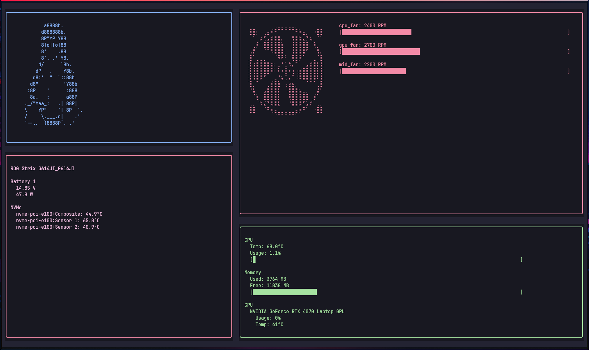

# hwmon

A lightweight terminal-based hardware monitor and fan control utility for Linux.


**Note:**  
This project currently works only on linux laptops.  

---

## Screenshot



---

## Features

- CPU and Memory usage monitor
- fan rpm monitor
- temp monitor for other like nvme 
- voltage and power used and remaining battery life
- can write custom fan-temp curves 
- TUI made with Textual

---

## Requirements

- Linux
- Python 3.10+
- `hwmon` support in the kernel

only for V1
- Root access (required for fan control)
---

## Installation

```bash
git clone https://github.com/shalonjovan/hwmon.git
cd hwmon
python -m venv venv
source venv/bin/activate
pip install -r requirements.txt
chmod +x run.sh


## Plans
- make themes updatable on real-time